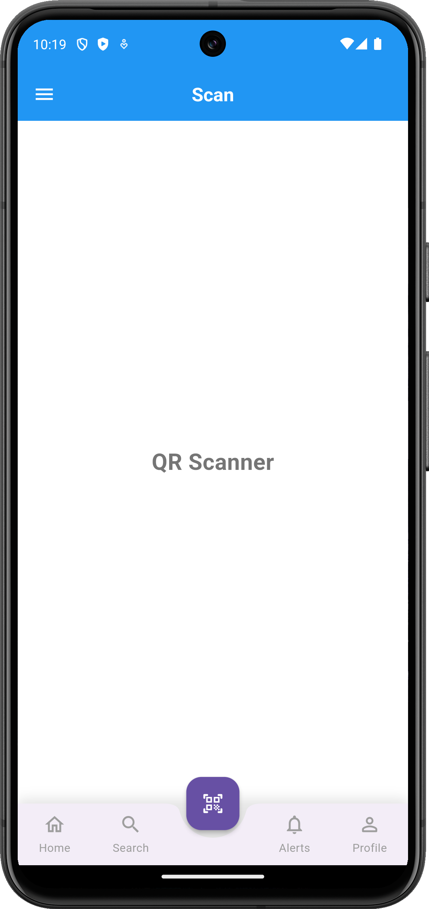

# flutter_essentials

A Flutter project for learning flutter efficiently

## Getting Started

This project is a starting point for a Flutter application.

A few resources to get you started if this is your first Flutter project:

- [Lab: Write your first Flutter app](https://docs.flutter.dev/get-started/codelab)
- [Cookbook: Useful Flutter samples](https://docs.flutter.dev/cookbook)

For help getting started with Flutter development, view the
[online documentation](https://docs.flutter.dev/), which offers tutorials,
samples, guidance on mobile development, and a full API reference.

## Screenshots

    

        <h3>Home Screen</h3>
        
    

    

        <h3>UI Components Screen</h3>
        
    

    

        <h3>UI Components Screen 2</h3>
        
    

    

        <h3>Code Viewer Modal</h3>
        
    

    

        <h3>Animations Screen</h3>
        
    

    

        <h3>Boilerplate's Screen</h3>
        
    

    

        <h3>API Methods Screen</h3>
        
    

    

        <h3>Examples Screen</h3>
        
    

    

        <h3>Sliver Screen</h3>
        
    

    

        <h3>Charts Screen</h3>
        
    

    

        <h3>Custom Bottom Bar Screen</h3>
        
    

    

        <h3>Internationalization Screen</h3>
        
    

