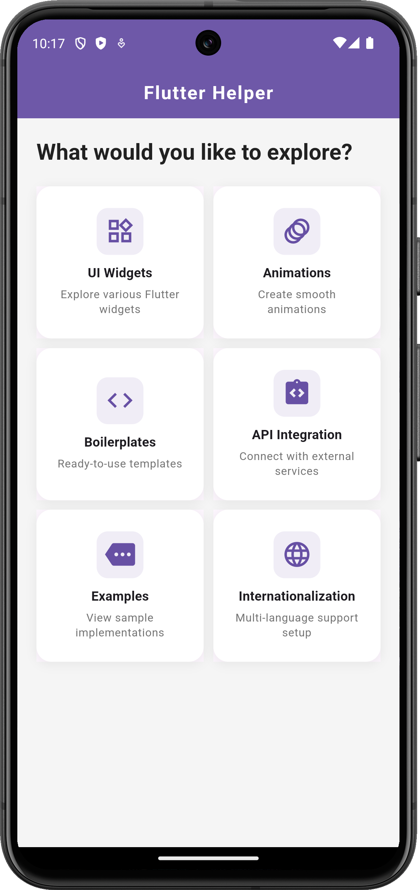

# flutter_essentials

A Flutter project for learning flutter efficiently

## Getting Started

This project is a starting point for a Flutter application.

A few resources to get you started if this is your first Flutter project:

- [Lab: Write your first Flutter app](https://docs.flutter.dev/get-started/codelab)
- [Cookbook: Useful Flutter samples](https://docs.flutter.dev/cookbook)

For help getting started with Flutter development, view the
[online documentation](https://docs.flutter.dev/), which offers tutorials,
samples, guidance on mobile development, and a full API reference.

## Screenshots

### Home Screen

### UI Components Screen

### Code Viewer Modal

### Animations Screen

### Boilerplate's Screen

### API Methods Screen

### Examples Screen

### Sliver Screen

### Charts Screen

### Custom Bottom Bar Screen

### Internationalization Screen
